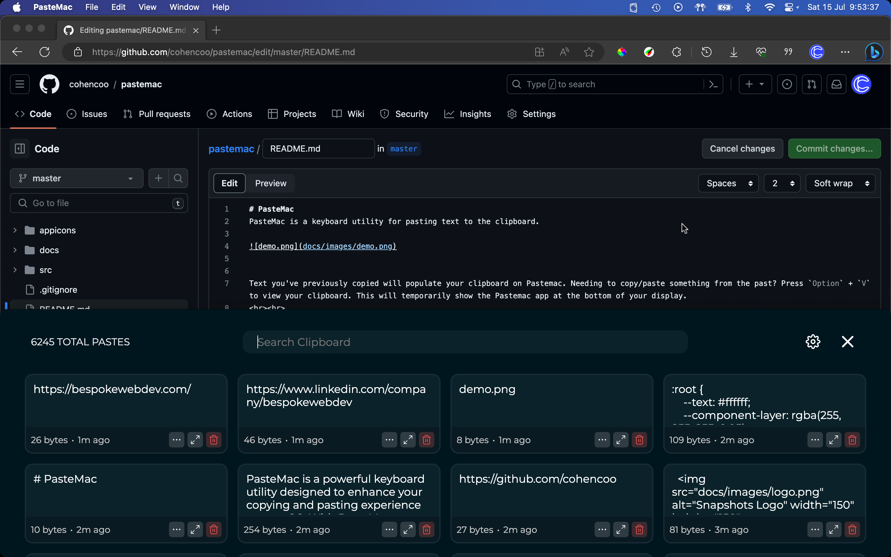
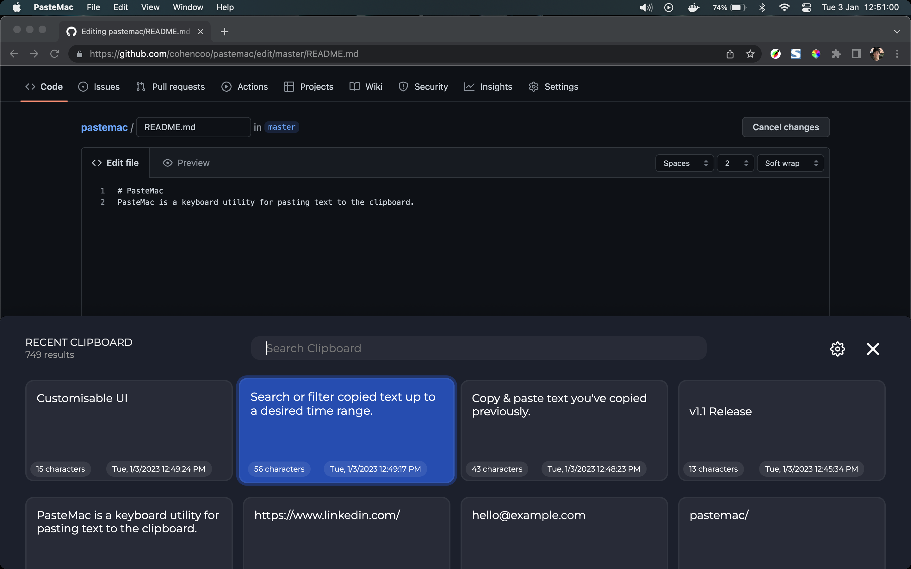

# PasteMac

PasteMac is a powerful keyboard utility designed to enhance your copying and pasting experience on macOS. With PasteMac, you gain full control over your clipboard history, enabling quick access to previously copied text and enhancing your productivity.

## Key Features

-   **Effortless Clipboard Management:** PasteMac automatically captures and organizes your copied text, allowing you to access previous clipboard entries with ease. Say goodbye to losing important snippets or struggling to remember previously copied content.

-   **Quick Clipboard Access:** By pressing `Option` + `V`, PasteMac brings up a sleek and customizable clipboard viewer at the bottom of your display. Instantly browse and select the text you need for seamless pasting.

-   **Flexible Customization:** Customize the number of results displayed in your clipboard, ensuring that you have quick access to the most relevant snippets. Adjust the app's appearance and background to match your personal style and preferences.

-   **Advanced Clipboard Interactions:** Delete specific clipboard entries or view the timestamp of each copied item to gain insights into your copying habits and track when specific text was added to your clipboard.

-   **Efficient Keyword Search:** Utilize the search feature to quickly find specific keywords or phrases across your entire clipboard history. Never waste time scrolling through endless entries again!

## Use anywhere with `Option` + `V`

When writing anywhere on your Mac, simply press `Option` + `V` to bring up the PasteMac clipboard viewer. From there, you can browse your clipboard history and select the text you need for seamless pasting.

## Customize your experience

